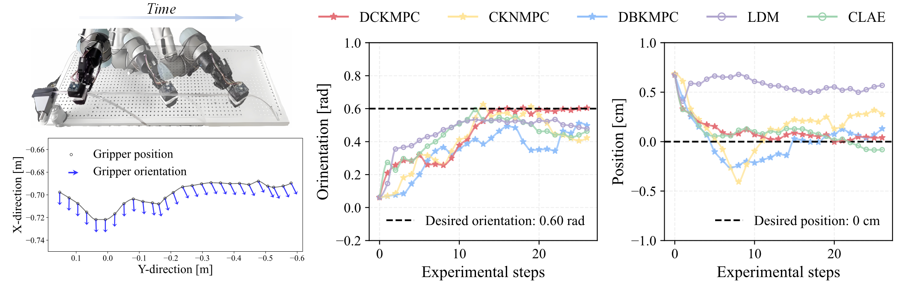

# Dynamic Contrastive Koopman Operator for Tactile Servo of Deformable Linear Objects

## The paper is currently under review.


## Requirements
The code has been tested under
* Ubuntu 20.04 + NVIDIA GeForce RTX 1080Ti (CUDA 12.2)
* PyTorch 1.12.1

## Environment Setup
### Setup anaconda environment
```
$ conda create --name DCKO python=3.7.6 -y
$ conda activate DCKO
$ pip install -r /path/to/your/requirements.txt
```


## Experiment
The vedio of extensive robotic experiments could be found at [here](https://youtu.be/pHUMUcxe_zc)



## Dataset Preparation

* dataset_DCKO_tactileServo_DLO: Click [here](https://drive.google.com/file/d/18ZH7K1uB_Ob6gg9SgTeLdVKl9XT1iL7-/view?usp=sharing)
